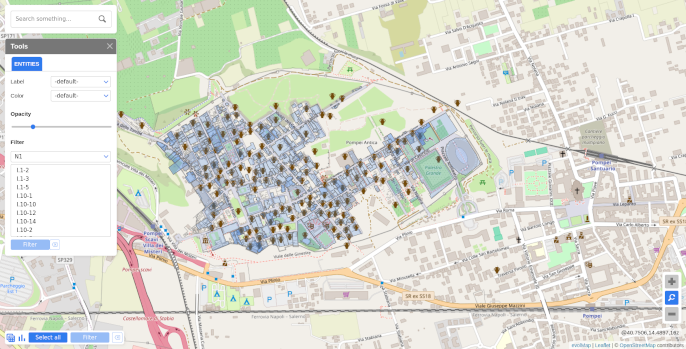
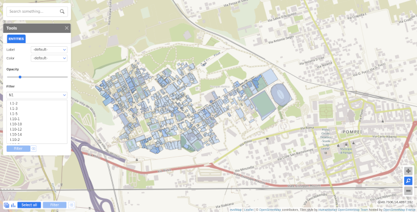
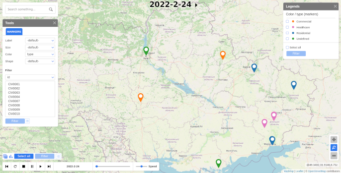
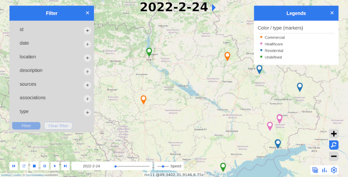

# Evolving Maps with `evolMap`

## Introduction

The `evolMap` package provides an easy and flexible way to create **interactive, time-evolving maps** from spatial data in R. It is particularly useful for visualizing historical changes, events over time, or evolving geospatial datasets, using **Leaflet** as the underlying engine. Key features include:

- Integration with `sf` and GeoJSON for spatial data
- Support for time-aware markers and geometries
- Easy customization of base maps, tiles, and map styles
- Export of HTML-based maps to local directories for web use

This vignette demonstrates how to use `evolMap` to:

- Visualize a historical site (Pompeii) from GeoJSON data
- Animate event data (Ukraine war incidents) over time
- Change base map styles and render modes

## Description

The `evolMap` package represents and manages information from a database on an interactive geographic map. It also allows you to view the evolution of added elements over time or through periods.

Components:

- **Entities:** Markers, Lines, Images, Shapes, Choropleths, Links.
- **Information:** Table, Name, Tooltip, Information Window.
- **Utilities:** Entity Search, Filter, Display Customization, Playback Controls, Bar Charts.

## Example 1: Visualizing Pompeii Parcels from GeoJSON

```{r message=FALSE, warning=FALSE}
library(evolMap)
library(sf)
```

Read geojson
```{r message=FALSE, warning=FALSE, results='hide'}
# Source: https://github.com/scriptorivm/pompeii
domi <- st_read('https://raw.githubusercontent.com/scriptorivm/pompeii/master/geojson/domi.geojson')

domi[["info"]] <- paste0("<iframe src=\"",sub("http:","https:",domi[["N3"]]),"\"></iframe>")
domi[is.na(domi[["N3"]]),"info"] <- "Missing info"
```

Map creation and add information of geojson

You can specify initial coordinates and zoom level in `create_map` function
```{r}
map <- create_map(center=c(40.750556,14.489722), zoom=16)
map <- add_entities(map,domi,info="info")
plot(map, directory = "pompeii")
```

```{r echo=FALSE}

```

## Change Base Map Provider

```{r}
# https://leaflet-extras.github.io/leaflet-providers/preview/
map <- create_map(center=c(40.750556,14.489722), zoom=16, provider="OpenStreetMap.HOT")
map <- add_entities(map,domi,info="info")
plot(map, directory = "pompeii_provider")
```

```{r echo=FALSE}

```

## Example 2: Ukraine War — Evolving Event Map
```{r}
# Source: https://ukraine.bellingcat.com/
data <- read.csv(system.file("extdata", "ukr-civharm-2023-02-27.csv",
        package="evolMap"))
data[["date"]] <- as.Date(data[["date"]],"%m/%d/%Y")

data[["type"]] <- NA
for(i in seq_len(nrow(data))){
  if(data[i,"associations"]!=""){
    data[i,"type"] <- unlist(strsplit(unlist(strsplit(data[i,"associations"],","))[1],"="))[2]
  }
}

map <- create_map(center=c(49.3402,31.9146),zoom=6.75)
map <- add_markers(map, data, color = "type",
  latitude = "latitude", longitude = "longitude",
  start = "date")
plot(map, dir="ukraine")
```

```{r echo=FALSE}

```

## Example: Change Map Style with `mode = 2`
```{r}
map <- create_map(center=c(49.3402,31.9146),zoom=6.75, mode=2)
map <- add_markers(map, data, color = "type",
  latitude = "latitude", longitude = "longitude",
  start = "date")
plot(map, dir="ukraineNew")
```

```{r echo=FALSE}

```

## Summary

The `evolMap` package enables:

- Easy loading and visualization of geospatial data  
- Support for both static features and time-evolving markers  
- Integration with various map tile providers and styles  
- HTML export for sharing maps online or offline
